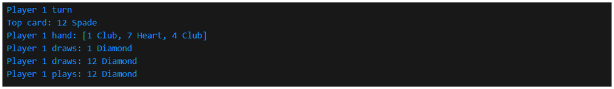

# 🎮 Crazy Eights Java Console Game

A fully functional, AI-powered Crazy Eights card game built in Java to reinforce object-oriented programming and algorithmic design principles.

---

## 🔍 Project Summary

- Developed a modular Java console game using OOP concepts such as abstraction, encapsulation, inheritance, and enumerations  
- Implemented core mechanics including wild card behavior (Eights), turn rotation, and discard pile reshuffling  
- Simulated automated computer player actions and conditional logic for legal play and suit selection  
- Built test coverage using JUnit to validate gameplay logic and ensure robustness across various game states  

---

## 📊 Tools & Technologies

- **Language**: Java  
- **Environment**: Java SE 8+ (tested on OpenJDK 21)  
- **IDE**: NetBeans, Visual Studio Code  
- **Testing**: JUnit  

---

## 📁 Repository Contents

| Path                | Description                                         |
|---------------------|-----------------------------------------------------|
| `src/main/java/`    | Core game logic (Card, Deck, Player, Game, etc.)    |
| `src/test/java/`    | Unit tests for gameplay classes                     |
| `images/`           | Screenshot Outputs of Gameplay                      |
| `pom.xml`           | Maven project file                                  |
| `target/`           | Compiled outputs (auto-generated)                   |
| `README.md`         | Project summary and setup instructions              |

## 🖼️ Gameplay Screenshots

**Game Start**  

**Drawing Cards**  

**Crazy Eight Suit Change**  

**Deck Reshuffled**  

**Game Finish**  

---

## 🚀 Future Enhancements  
- Add support for interactive human player input  
- Develop graphical interface (GUI) for improved gameplay experience  
- Expand AI strategy and difficulty scaling   

---

## ▶️ How to Run

1. Clone the repository
2. Open the project in your Java IDE
3. Compile and run `CrazyEightGame.java` from the `main` package
